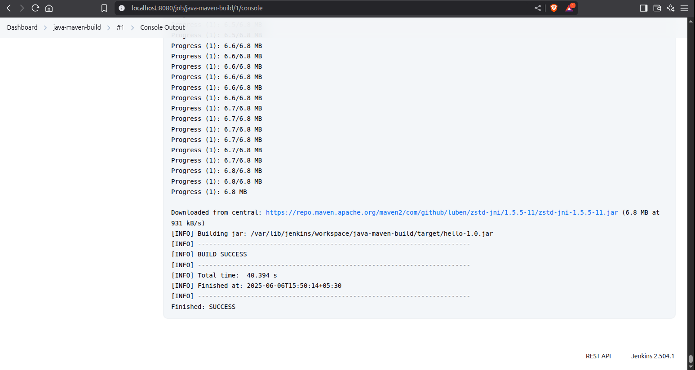

# 🚀 DevOps Internship - Task 8: Running a Java Maven Build in Jenkins

## 📌 Objective
Learn how to set up a Jenkins pipeline to build a simple Java application using Maven, taking the next step into Continuous Integration/Continuous Deployment (CI/CD).

## 📋 What I Did
I successfully created a CI/CD pipeline that:
1. Built a simple "Hello World" Java application
2. Automated the build process using Jenkins
3. Configured Maven as the build tool
4. Verified the build success through Jenkins console output

## 🛠 Tools Used
- Jenkins (via Docker)
- Apache Maven 3.9.10
- Java JDK 17.0.15
- Git for version control

## 📂 Project Structure
```
Running-a-Java-Maven-Build-Job-in-Jenkins/
├── src/
│   └── main/
│       └── java/
│           └── HelloWorld.java
├── pom.xml
├── jenkins-screenshot.png
├── local test.png
└── README.md
```

## 🚀 Step-by-Step Implementation

### 1. Created the Java Application
I created a simple Java program that prints a message:

**`src/main/java/HelloWorld.java`**
```java
public class HelloWorld {
    public static void main(String[] args) {
        System.out.println("Hello, Jenkins + Maven!");
    }
}
```

### 2. Configured Maven Build
I created a `pom.xml` file to define the build configuration:

**`pom.xml`**
```xml
<project>
  <modelVersion>4.0.0</modelVersion>
  <groupId>com.example</groupId>
  <artifactId>hello</artifactId>
  <version>1.0</version>
  <build>
    <plugins>
      <plugin>
        <groupId>org.apache.maven.plugins</groupId>
        <artifactId>maven-compiler-plugin</artifactId>
        <version>3.9.10</version>
        <configuration>
          <source>1.8</source>
          <target>1.8</target>
        </configuration>
      </plugin>
    </plugins>
  </build>
</project>
```

### 3. Set Up Jenkins via Docker
I launched Jenkins using Docker with this command:
```bash
docker run -d --name jenkins -p 8080:8080 -p 50000:50000 jenkins/jenkins:lts
```

### 4. Configured Jenkins
After initial setup:
1. Installed suggested plugins
2. Created admin user
3. Configured Maven in **Manage Jenkins > Tools**

### 5. Created Jenkins Job
I created a Freestyle project with:
- **Source Code Management**: This GitHub repository
- **Build Step**: Invoke top-level Maven targets
- **Maven Version**: Maven-3.9.10
- **Goals**: `clean package`

### 6. Executed the Build
Triggered the build manually and verified success in the console output.

## ✅ Successful Build Screenshot


## 💡 Key Learnings
- **Jenkins Jobs**: Automated build/test workflows
- **Maven Lifecycle**: Understanding `clean` and `package` phases
- **CI/CD Fundamentals**: First step in automation pipeline
- **Troubleshooting**: Reading console output to debug failures

## ❓ Interview Questions & Answers

1. **What is Jenkins?**  
   Open-source automation server for CI/CD pipelines.

2. **How do you create a Jenkins job?**  
   New Item → Enter name → Select Freestyle project → Configure build steps.

3. **What is Maven used for?**  
   Build an automation tool for Java projects (dependency management, compilation, packaging).

4. **How does Jenkins use build tools like Maven?**  
   Jenkins executes Maven commands (e.g., `mvn clean package`) via build steps.

5. **What is the difference between compile and package in Maven?**  
   `compile`: Builds source code → `.java` to `.class`  
   `package`: Compiles + packages into distributable format (JAR/ZIP)

6. **Where do you configure tools in Jenkins?**  
   Manage Jenkins → Tools (global configurations for JDK, Git, Maven).

7. **How do you debug a failed Jenkins build?**  
   Check Console Output for error messages and stack traces.

## ⚠️ Troubleshooting Tips
- If the build fails, check:
  1. Maven installation in Jenkins
  2. Correct file paths in the repository
  3. Java version compatibility
  4. Network connectivity for dependencies
- Always check **Console Output** first for errors

This project demonstrates fundamental CI/CD concepts using industry-standard tools—a crucial skill for DevOps engineers.
